# Descriptron v2 with BioRAG - 
## Production use ready - installable with pip, Docker or MCP (eg. Claude-Code)
 
<p>
  <a href="https://doi.org/10.5281/zenodo.22958109"></a>
  &nbsp;
  &nbsp;<a href="#mcp-server">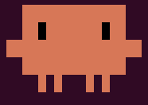</a>
</p>

**Morphology-driven species descriptions, keys and delimitation for dark taxa.**

Descriptron takes photographs or micro-CT slices of specimens and produces the
things a taxonomist actually needs: measured structures, a character matrix, a
dichotomous key, formatted species treatments, and a record of how every number
was obtained. Annotation is model-assisted; the analysis is deterministic; and
every claim in the output is checked against the data it came from.

> **v2 is a rewrite of everything downstream of annotation.** v1 produced
> descriptions by handing measurements to GPT-4o. v2 replaces that with an
> evidence-tiered pipeline (**BioRAG**) in which the key, the matrix, the
> delimitation and the audits are computed, and a language model is used only to
> write prose from numbers it is not allowed to invent. The model's context is
> retrieved first and foremost from **the measured data matrix**, which is the
> primary retrieval and the basis of every analysis; **the literature**
> (BioSysLit and your own PDFs) is a secondary, optional source.

<p align="center">
  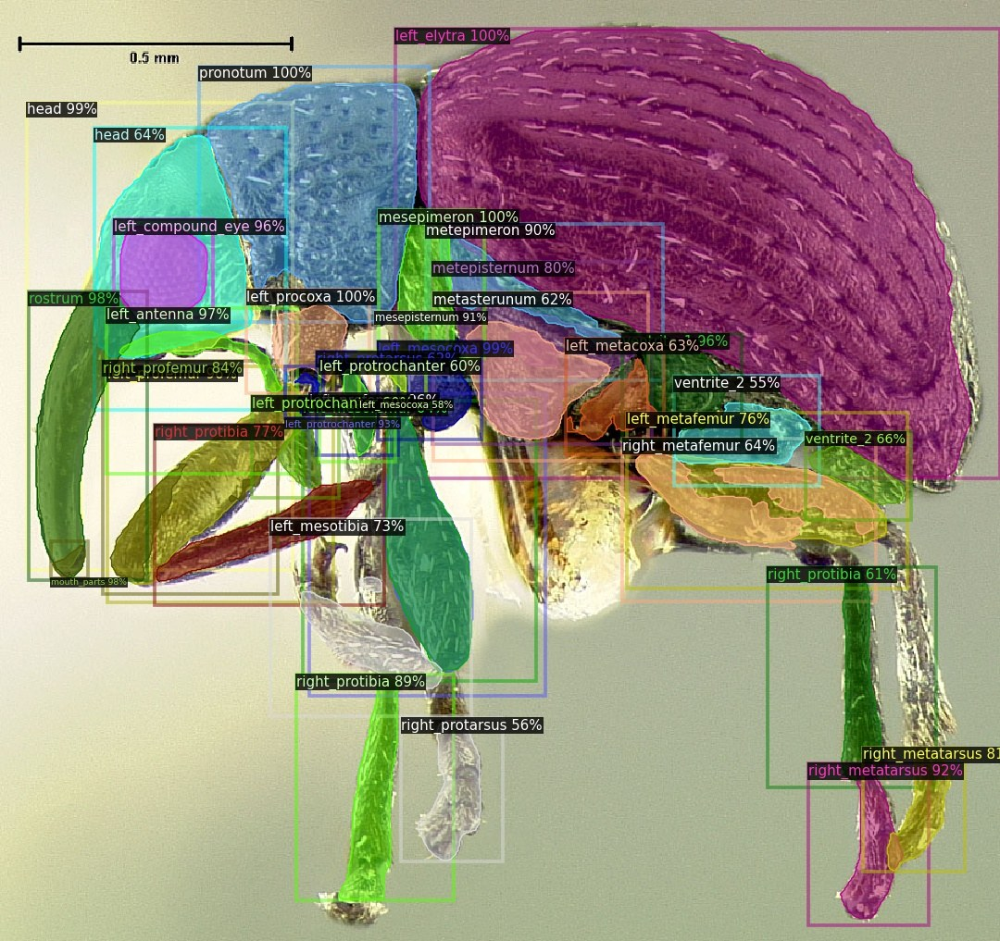
  <br>
  <sub>Automated instance segmentation of a weevil in lateral view: each structure is a labelled mask with the model's confidence.</sub>
</p>

---

## Contents

- [The approach at a glance](#the-approach-at-a-glance)
- [What v2 adds](#what-v2-adds)
- [Installing](#installing) — pip · Docker · conda
  - **[Docker how-to](docs/DOCKER_RECIPE.md)** — step-by-step recipe: project folder, full pipeline, Linux and Windows
  - **[Shared VM hosting recipe](docs/SHARED_VM_RECIPE.md)** — for IT staff: one institutional VM, shared GPU, many users
- **[Tutorial: the GUI tab by tab](docs/TUTORIAL.md)** — annotation, prediction, measurement, shape statistics, utilities
- [Automated trait collection: measurements, shape, colour and texture](#automated-trait-collection-measurements-shape-colour-and-texture)
  - [Checked against geomorph](#checked-against-geomorph) · [An alternative to geomorph for 2D images](#an-alternative-to-geomorph-for-2d-images) · [Examples](#what-it-produces-examples)
- [The workflow](#the-workflow)
  - **[SAM2-PAL & DINOLand annotation SOP](docs/SAM2PAL_DINOLand_Annotation_SOP.md)** — imaging, references, recipes and the orientation/mirror options
- [What BioRAG retrieves: the data matrix and the literature](#what-biorag-retrieves-the-data-matrix-and-the-literature)
- [What the programs produce](#what-the-programs-produce)
- [Reproducing an analysis](#reproducing-an-analysis)
- [Provenance and auditing](#provenance-and-auditing)
- [Use Descriptron from Claude (MCP server)](#mcp-server)
- [Licence](#licence)
- [Citation](#citation)

---

## The approach at a glance

From specimen images to audited species treatments: (A) a few specimens are annotated and the rest are
predicted and corrected; (B) every structure is measured, its shape, colour and texture recorded, and the
features assigned to evidence tiers in a checkable matrix; (C) the key is computed from the matrix, and a
language model writes the treatments, which an independent audit checks against the matrix; (D) which
descriptive words can be trusted, and whether an unseen species can be recognised, are tested on the same
specimens. The numbers are from the 29-species *Diaphorina* run.

```
  images ──► ANNOTATE ──► PROPAGATE ──► MEASURE ──► SCREEN ──► MATRIX
                GUI        SAM2-PAL      mm, GPA,    outliers,   evidence
             SAM2-assisted  DINOLand     colour,     flips,      tiers
                                         texture     conflicts      │
                                                                    ▼
   treatments ◄── AUDIT ◄── KEY ◄── DELIMIT ◄──────────────────── characters
    .docx, XML,  numeric   couplets  matrix / key / graph,
    DwC-A, SDD   + words   + support  calibrated on your own set
```

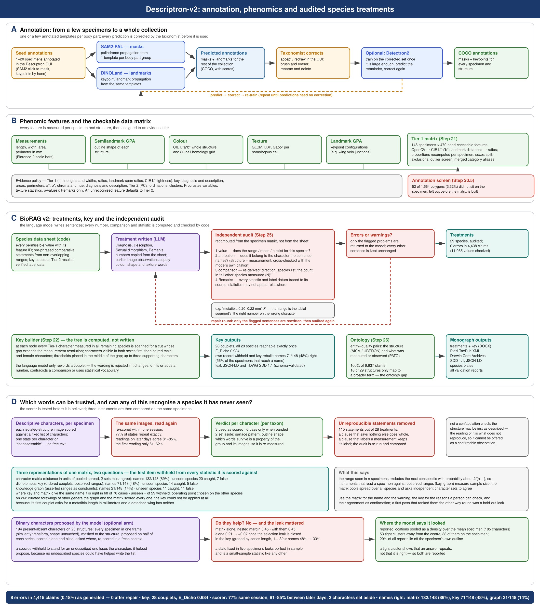

---

## What v2 adds

| | v1 | v2 |
|---|---|---|
| descriptions | GPT-4o from a feature table | **BioRAG**: evidence tiers, numbers checked against the matrix, every sentence attributable |
| key | — | computed from the matrix, leave-one-specimen-out validated, jackknife couplet support |
| delimitation | — | matrix / key / graph instruments, calibrated on your own reference set |
| mask propagation | Detectron2 only | **SAM2-PAL** palindrome propagation, **DINOLand** DINOv3 landmark transfer, torchvision detectors |
| checking | — | independent confabulation audit, subjective-word checks, ontology annotation |
| install | eight conda environments | **`pip install descriptron`**, or one Docker image |
| shape and form (2.1) | GPA, PCA, MANOVA/CVA | + Procrustes ANOVA with metadata (species x locality...), trajectories, disparity, allometry slopes, 2B-PLS, Mantel, asymmetry, modularity, Kmult, assignment; mirror images reflected automatically; the Procrustes statistics checked against geomorph and RRPP (Mantel and assignment by known-answer tests) |
| more tools (2.1) | — | centre lines of thin structures, joint angles and posture standardisation, pose skeletons, video tracking with pose (DeepLabCut export), TPS / MorphoJ / StereoMorph / VIA converters, Darwin Core metadata import |

Nothing in the analysis half needs a GPU, and the key, matrix, audits and
delimitation need no model at all.

---

## Automated trait collection: measurements, shape, colour and texture

Descriptron turns specimen photographs into a table of traits, specimen by specimen, with every step
automated after a few annotated examples:

1. **Annotate a few, predict the rest.** Structures are outlined with SAM2 and carried to the rest of the
   collection by SAM2-PAL; landmarks are carried by DINOLand. You check and correct, not draw.
2. **Morphometrics.** Lengths, widths, areas and ratios in millimetres, with scale bars read from the images;
   curved length, width and curvature of thin structures along their centre line (within 0.3 % of the true
   length on test shapes, where a straight measurement under-reads curved structures by 17–23 %); joint angles
   from a pose skeleton.
3. **Geometric morphometrics.** Landmark GPA and outline semilandmarks (fixed, or slid by Procrustes distance
   or bending energy), mirror-image specimens found and reflected, shape PCA, and shape statistics driven by your
   specimen metadata: Procrustes ANOVA with permutation (RRPP), allometry, trajectories, disparity,
   shape vs environment, Mantel, asymmetry, modularity and integration, phylogenetic signal, assignment of
   unidentified specimens.
4. **Colour, colour pattern and texture.** CIE L\*a\*b\* and HSV colour with optional background-based correction of
   the illumination cast, colour classes and markings, and colour and texture measured in a grid of
   **homologous cells**: after the superimposition the semilandmarks are frozen in their settled
   correspondence and mapped back onto each photograph, so the same cell covers the same anatomy on every
   specimen.
5. **One table.** Everything is joined per specimen, calibrated to millimetres, and feeds the character
   matrix, the key and the descriptions, or your own analyses.

**How this is checked.** Every number in the geometric-morphometric part was compared with R on the same data:
with geomorph from raw landmarks (below), and with RRPP on identical aligned data. The comparison scripts are
in `descriptron/measure/validation/` and can be rerun by anyone with R. The checks found real problems, which
2.1 fixes and which are described below rather than hidden. The colour and texture values themselves are
standard measures (CIE L\*a\*b\*, GLCM, LBP); what is checked is that they are taken from homologous places
(panel g of the third figure).

### Checked against geomorph

Descriptron's geometric morphometrics are written in Python, so we ran the same data through R's
**geomorph** (4.1.1) and compared every number. Raw landmarks go into both, and each side does its own
Procrustes superimposition. Centroid sizes, Procrustes distances, Procrustes ANOVA (SS, R², F),
disparity, modularity (CR), two-block PLS, phylogenetic signal (Kmult) and asymmetry agree to at most
5.6 × 10⁻⁴ relative difference, most to 10⁻⁶ or better; permutation P-values differ only by random sampling.
Real data: 84 Diaphorina forewings plus synthetic designs with known effects.


Outline semilandmarks agree with `gpagen` on the same points, fixed (the default) and with both of geomorph's
sliding methods, new in 2.1 (`--slide_method procd`: minimum Procrustes distance; `bending`: minimum bending
energy) to 5 × 10⁻¹¹. After the superimposition the semilandmarks are frozen in their settled correspondence
and mapped back onto each photograph, so colour and texture are measured in the same anatomical cell of every
specimen, something geomorph does not do.


The pipeline's other geometric-morphometric steps get the same check: landmark GPA, the outline shape PCA
(now on the covariance of the Procrustes coordinates, as geomorph's `gm.prcomp`; earlier versions standardised
every coordinate first) and the homology frames all agree with geomorph, and the colour and texture measured
in homologous cells land on the same anatomy for mirror-image specimens once they are reflected.


The checks found, and 2.1 fixes, one problem worth knowing about: **mirror-image specimens** (a wing
photographed from the other side) cannot be superimposed without reflection, and dominated the first
principal component (19 of 96 Diaphorina forewings: PC1 95.7 % -> 30.0 % once reflected). Landmark and
outline GPA now find the mirror images, reflect them before alignment and list them; the colour pattern of the
mirror-image wings' homologous cells then matches the other wings again (r = 0.69, was 0.36). The comparison scripts
are in `descriptron/measure/validation/` (R and geomorph are needed only to rerun them); a comparison with
RRPP on identical aligned data is in the [tutorial](docs/TUTORIAL.md#metadata-and-shape-statistics).

### An alternative to geomorph for 2D images

For two-dimensional landmark and outline data, Descriptron now covers most of what taxonomists and
morphologists use geomorph (and tpsDig, MorphoJ or StereoMorph, whose files it reads and writes) for, gives
the same numbers, and adds the steps those programs leave to you: collecting the landmarks and outlines,
calibrating to millimetres, finding mirror-image specimens, and measuring colour and texture in homologous
regions. You can stay in one Python workflow from photograph to statistics.

| | geomorph | Descriptron | checked |
|---|---|---|---|
| GPA, landmarks | `gpagen` | `landmark_gpa_V2`, `descriptron_shape_stats` | same numbers |
| outline semilandmarks, fixed or sliding (Procrustes distance, bending energy) | `gpagen(curves=)` | V42 `--slide_method` | same numbers |
| shape PCA | `gm.prcomp` | V42, landmark GPA | same numbers |
| Procrustes ANOVA, allometry | `procD.lm` | `anova`, `allometry` | same numbers |
| trajectory analysis | `trajectory.analysis` (RRPP) | `trajectory` | same numbers (RRPP) |
| disparity | `morphol.disparity` | `disparity` | same numbers |
| 2B-PLS, modularity (CR) | `two.b.pls`, `modularity.test` | `pls`, `modularity` | same numbers |
| phylogenetic signal | `physignal` | `phylosignal` | same numbers |
| object symmetry | `bilat.symmetry` | `asymmetry` | same numbers (Descriptron reports half the left-right difference) |
| posture standardisation | `fixed.angle` | `descriptron_joints standardise` | known-answer tests |
| Mantel, assignment with typicality | — (vegan, MASS) | `mantel`, `assign` | known-answer tests |
| collection, mm calibration, mirror images, colour and texture in homologous cells | — | built in | see above |
| **not (yet) in Descriptron:** 3D landmarks and surface semilandmarks, phylogenetic GLS (`procD.pgls`), evolutionary rate comparisons (`compare.evol.rates`), phylomorphospace | yes | no | — |

For these, and for any analysis we have not listed, use geomorph: Descriptron's converters write TPS and
MorphoJ files, and its aligned coordinates are plain tables.

### What it produces: examples

Assembled from the programs' output (panel titles added; the animation is drawn from SAM2-PAL's
predictions file).

**Annotate one, predict the rest, correct what needs it.** Step 0: one ant head annotated by hand (18
structures). Step 1: SAM2-PAL carries them to the other heads (examples drawn at random from 317 colour
photographs). Step 2: on hard plates, with the head small in a wide frame, some structures land in the wrong
place; they are corrected in the GUI, and the corrected heads can be used to fine-tune SAM2-PAL for the next
round. The last two frames show two such plates as predicted and after correction.

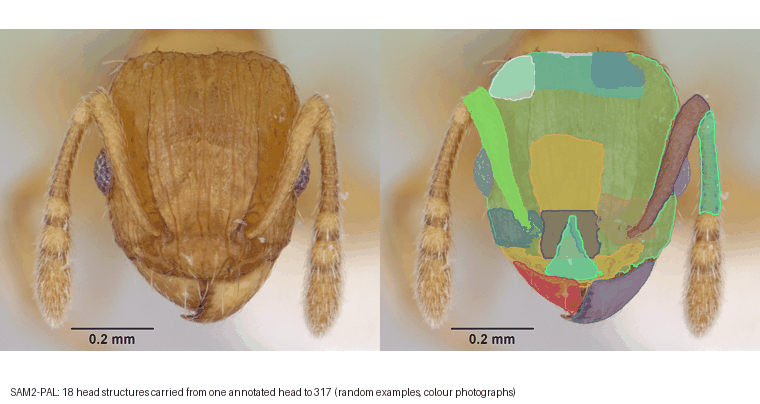

**Video, too.** Load a video (here a rotating micro-CT render of an ant head), mark a structure on a few
frames, and SAM2 follows it through every frame; the Video Remote Control steps through the frames, shows
which are annotated and lets you delete bad ones before fine-tuning (clip at 2x speed, earlier GUI layout).
Videos are of 3D Ant Models from Francisco Hita Garcia (OIST) 

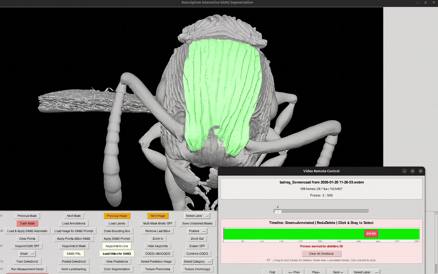

The same region followed through the full rotation of four heads with the fine-tuned model (about 3x speed):

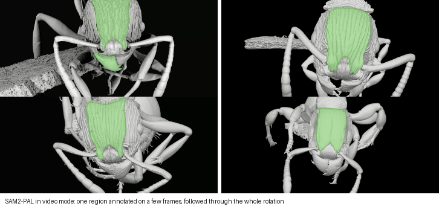

<sub>3D models: Francisco Hita Garcia (OIST) (Sketchfab).</sub>

**Landmarks, placed automatically.** DINOLand carries 17 vein-junction landmarks from hand-landmarked
reference wings to new psyllid forewings, whichever way up and whichever side they were photographed from
(`--orientation_search rot4 --mirror_refs`). Each landmark is marked as agreed by the references (filled green)
or to be checked (open gold), so you look only where it is needed. On 80 test wings, turned copies and mirror
images included, the median error was 2.3 % of wing size, with 78 % of landmarks within 5 % and 90 % within 10 %.
Psyllidae images are from Liliya Serbina (LIB Hamburg).

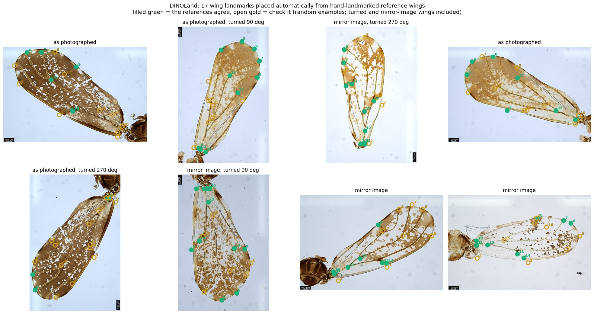

How much work that saves: in the test run below, DINOLand placed 1,360 landmarks (20 wings, each in four
orientations) in about four minutes on a laptop without a GPU. By hand that is 1,360 careful clicks; with
DINOLand you look at the gold points and move the ones that are off.

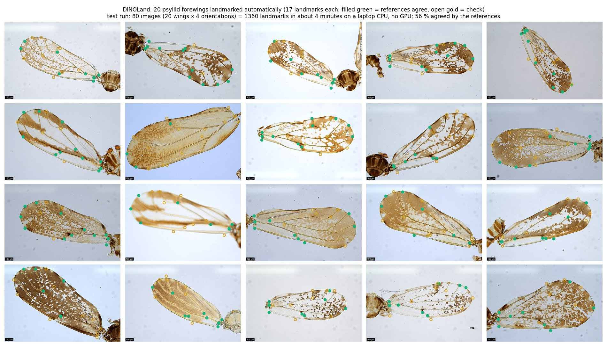

**Measurements** in millimetres, with the scale bar read from the image, and the centre line of a thin,
curved structure, whose curved length a straight measurement under-reads.

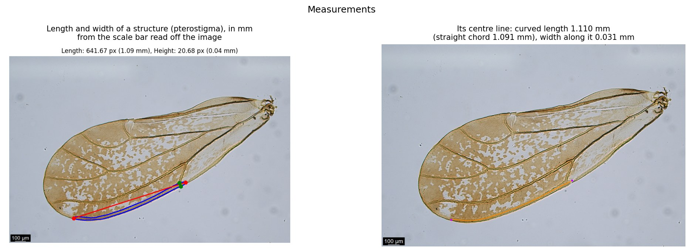

Measurements are not limited to masks. From your own keypoints (here 17 vein junctions of a psyllid forewing)
the measurement step gives every pairwise distance in millimetres, 136 of them, alongside the landmark
geometric morphometrics.

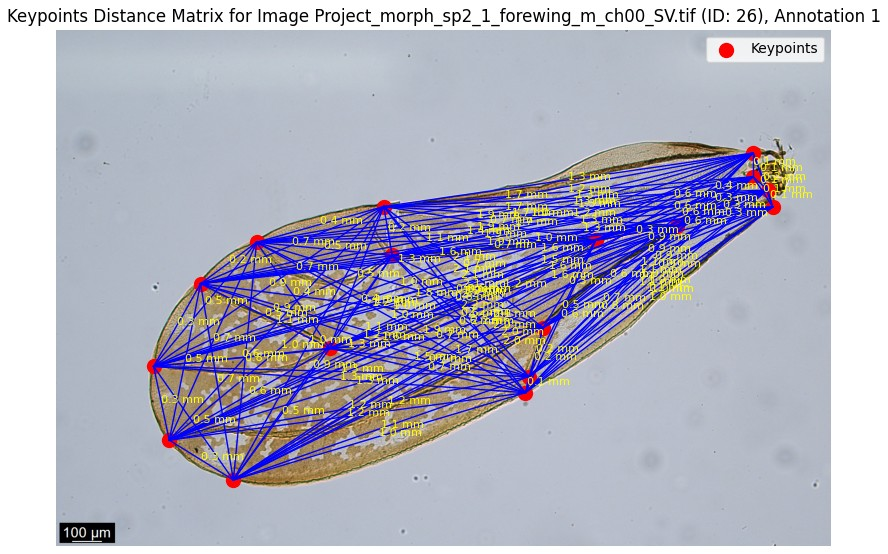

**Geometric morphometrics** of wing outlines: where along the outline the shape varies, and the specimens in
shape space.

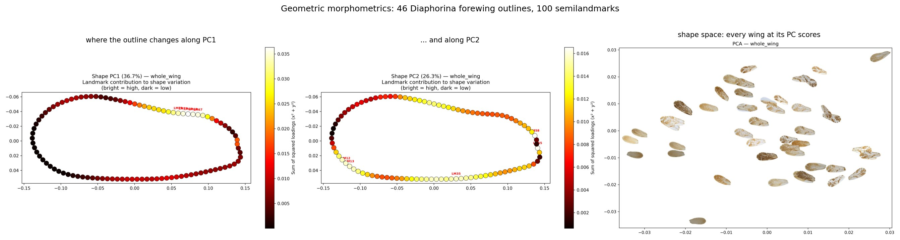

**Colour and colour pattern**: shine removal and illumination normalisation, colour classes and the pattern
mask, then colour measured in homologous cells, so the same cell covers the same anatomy on every wing.

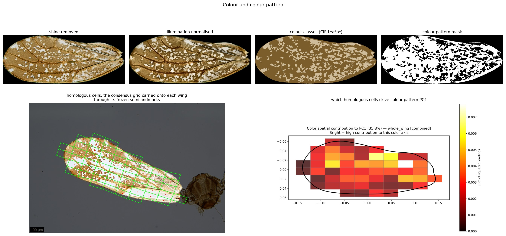

**Texture**: ant heads placed by the texture of their head capsule, measured in homologous cells.

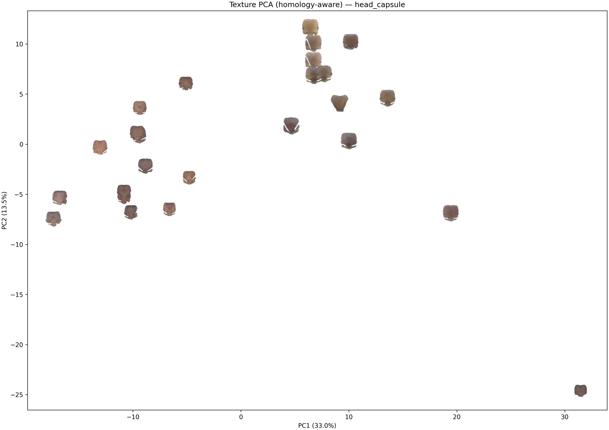

**Statistics from your metadata.** Import a specimen table or a Darwin Core download, mark the columns, and one
command runs the analyses the metadata support. Below, 96 psyllid forewings: species explain 72 % of forewing
shape and sex nothing; size has a small effect with the same slope in every species; and the 12 wings of
species outside the reference set are all flagged as unlike every known species rather than forced into the
nearest one.

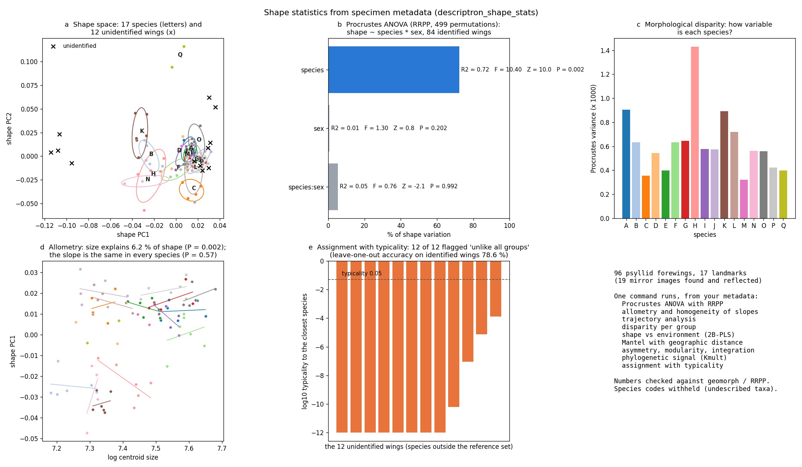

### From traits to species descriptions (BioRAG)

The traits of every specimen become a character matrix, and from it a key, species descriptions and a check
on whether a specimen belongs to a known species at all ([the approach at a glance](#the-approach-at-a-glance)).
Results on 29 *Diaphorina* species (148 specimens):

**Naming a specimen, and recognising a species never seen.** Each specimen's own record is withheld before it is
named. The character matrix names 132 of 148 correctly, and of the three instruments it best recognises a
species it has never seen (A: every operating point, and the estimate when the threshold is chosen without the
species being scored).

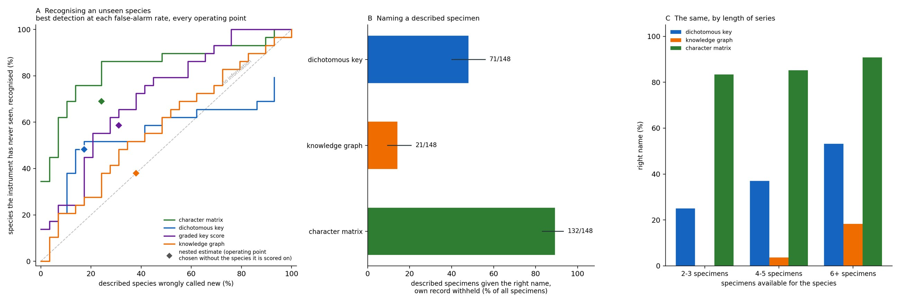

**What one character is worth.** For each structure, how often its best single character alone points to the
right species for a withheld specimen, and every character's worth for naming against novelty. Single
characters rarely suffice; the matrix works because it combines many.

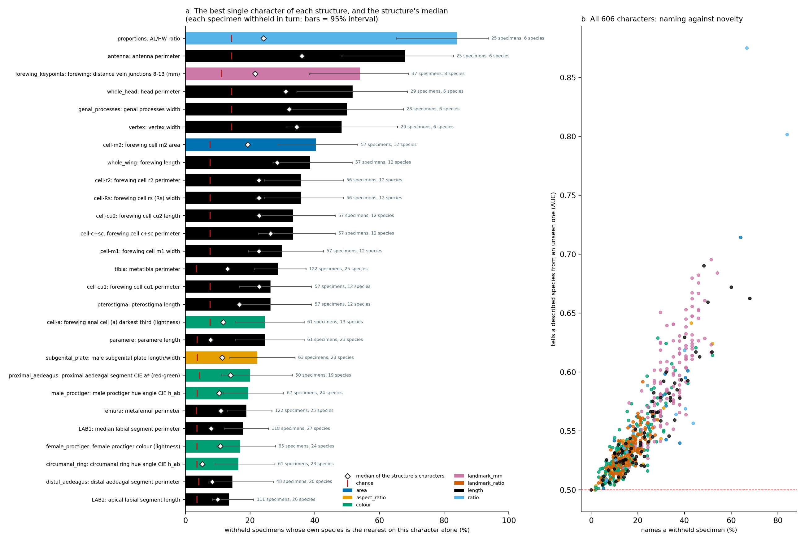

**How far apart the species are, and which characters hold up.** Species placed by their distances in the
matrix (a), the gap between every pair (b), and the support for the characters the knowledge graph and the key
use, each tested on specimens withheld from it (c, d).

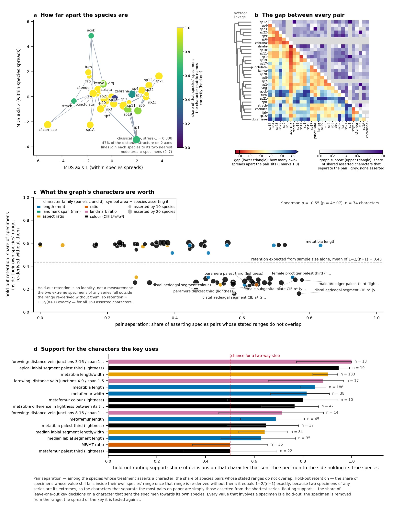

**A species treatment, written from the data and audited.** A language model writes the sentences; every
number comes from the matrix and an independent audit re-derives each one (numbers, the structure they
belong to, and every comparison) before the treatment is accepted. Descriptive words about shape and surface
come from images read by the model and are reported with their measured repeatability. Excerpt, *Diaphorina*
sp. 'kenya', collected in Kenya (undescribed species carry working codes until they are named):

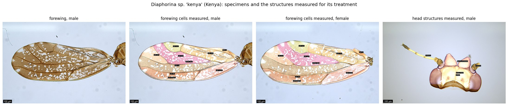

> **Diagnosis.** Diaphorina sp. 'kenya' differs from most congeners in characters of the distal aedeagal segment, male proctiger and male subgenital plate. Distal aedeagal segment length 0.138–0.163 mm, smaller than in all other species measured (19). Distal aedeagal segment colour L\* 51.0–57.0, darker (lower L\*) than in all other species measured (20) except D. cf. enderleini, D. sp. 1A and D. sp. 3; its palest third L\* 58.8–62.9, darker (lower L\*) than in all other species measured (20) except D. sp. 3. Male proctiger relatively long: MP/PL ratio 1.39–1.50×, greater than in all other species measured (22) except D. cf. carrisae and D. sp. 1A; MP/DL ratio 1.96–2.23×. Male subgenital plate width 0.064–0.193 mm, smaller than in all other species measured (21) except D. sp. 9, D. sp. 19 and D. sp. 21; male subgenital plate length/width 1.34–3.84×, greater than in all other species measured (22) except D. sp. 4, D. sp. 5, D. sp. 9, D. sp. 17, D. turneri and D. virgata. Head and forewing ochreous brown; metafemur orange-brown.
>
> **Head.** Head width (HW) 0.339–0.378 mm (mean 0.355; n=6), head length 0.556–0.617 mm (mean 0.580; n=6), head longer than wide (length/width 1.58–1.73×, mean 1.63; n=6). Vertex width 0.191–0.249 mm (mean 0.216; n=6), vertex length 0.357–0.397 mm (mean 0.372; n=6), distinctly longer than wide (VL/VW; see Proportions). Genal processes present, elongate in outline (length/width 1.21–2.28×, mean 1.91; n=6), length 0.164–0.317 mm (mean 0.279; n=6), width 0.125–0.166 mm (mean 0.146; n=6); their length relative to vertex length, precise shape and apex form not assessable from the material examined. Head ochreous brown (L\* 57.3–64.1, a\* 8.0–10.0, b\* 34.3–38.5); vertex slightly paler, ochreous yellow (L\* 64.5–68.1, a\* 5.7–7.4, b\* 34.8–37.9); genal processes ochreous brown (L\* 52.1–64.4, a\* 8.2–13.4, b\* 37.9–41.1).
>
> **Metaleg.** Metafemur length (MF) 0.394–0.416 mm (mean 0.403; n=6), width 0.105–0.119 mm (mean 0.113; n=6), length/width 3.42–3.77× (mean 3.58; n=6), orange-brown (L\* 40.7–53.2, a\* 15.3–19.1, b\* 37.8–45.2), with a lightness contrast between its two end thirds (L\* difference 8.4–19.9). Metatibia length (MT) 0.562–0.588 mm (mean 0.574; n=6), width 0.0621–0.0682 mm (mean 0.0656; n=6), length/width 8.32–9.24× (mean 8.76; n=6), ochreous yellow (L\* 71.5–75.8, a\* 2.6–4.5, b\* 30.9–37.8). Metafemur shorter than metatibia (MF/MT; see Proportions); metatibia distinctly longer than head width (MT/HW; see Proportions). Metatarsus colour not assessable from the material examined.
>
> *(Excerpt, verbatim. The full treatment covers antenna, rostrum, forewing cells, male and female terminalia,
> proportions, sexual dimorphism, remarks and what could not be assessed from the material.)*

---

## Installing

### 1. pip — the normal route

```bash
pip install descriptron          # everything
descriptron-gui                  # the annotation GUI
descriptron --list               # the 62 analysis programs
```

Or take only what you need:

| package | what it gives you | needs |
|---|---|---|
| `descriptron-core` | the whole analysis half — measurements, matrix, key, treatments, audits | **nothing but pip.** No torch, no CUDA, no compiler |
| `descriptron-vision` | mask and landmark prediction: torchvision detectors, SAM2-PAL, DINOLand | torch (ordinary wheels; Apple GPU via MPS on macOS) |
| `descriptron-gui` | the annotation GUI | core + vision + tkinter |

**If you only want to reproduce a published analysis from deposited COCO files,
`pip install descriptron-core` is enough**, and it installs in about a minute on
Linux, macOS and Windows.

For an NVIDIA GPU, install torch from PyTorch's index first:

```bash
pip install torch torchvision --index-url https://download.pytorch.org/whl/cu121
pip install descriptron
```

Writing treatments is the only step that calls a language model:
`pip install "descriptron-core[llm]"`. **Keys** (an Anthropic API key for
descriptions with `--llm_backend api`; a Hugging Face token the first time DINOLand
downloads DINOv3) are read from the environment or from
`~/.config/descriptron/credentials`; if neither has one, you are asked the first
time it is needed, and it is saved there (`descriptron-keys --set NAME` to change). Literature retrieval from BioSysLit and
your own PDFs: `pip install "descriptron-core[rag]"` (see
[What BioRAG retrieves](#what-biorag-retrieves-the-data-matrix-and-the-literature)).

### 2. Docker — everything, including the parts pip cannot carry

docker pull ghcr.io/alexrvandam/descriptron:2.1.1

Two dependencies are not on PyPI and can never be declared by a published
package: **SAM2** and **Detectron2**. The image carries both, already built.

**Step-by-step recipe** (project folder, the full pipeline, Linux and Windows
commands, where the results go): [docs/DOCKER_RECIPE.md](docs/DOCKER_RECIPE.md).

```bash
docker pull ghcr.io/alexrvandam/descriptron:latest

docker run --rm --gpus all -v "$PWD:/data" -v descriptron-weights:/weights \
  ghcr.io/alexrvandam/descriptron:latest train-d2 \
    --coco-json /data/annotations.json --img-dir /data/images \
    --output-dir /data/out --dataset-name mytaxon --total-iters 35000

docker run --rm ghcr.io/alexrvandam/descriptron:latest help
```

**GPU support by platform** — read this before planning around Docker:

| platform | GPU inside the container |
|---|---|
| Linux + NVIDIA | yes (`nvidia-container-toolkit`, `--gpus all`) |
| Windows + NVIDIA | yes (Docker Desktop, WSL2 backend) |
| **macOS** | **no — none, ever** |

Docker Desktop on macOS runs a Linux VM with no passthrough to the Apple GPU, and
Apple Silicon has no CUDA. **Mac users should install with pip and use the
torchvision backend**, which reaches the Apple GPU through PyTorch's MPS device.

`podman` works as a drop-in and has no licensing condition, which matters for
larger institutions.

### 3. conda — for development, or to match the published environment exactly

```bash
git clone https://github.com/alexrvandam/Descriptron.git && cd Descriptron
conda env create -f environments/measure_env_environment.yml     # analysis
conda env create -f environments/samm_environment.yml            # SAM2, SAM2-PAL, DINOLand
conda env create -f environments/detectron2_env_environment.yml  # Mask R-CNN
```

Detectron2 must then be built from source; see `docker/Dockerfile` for the exact
sequence, including the two flags it needs (`--no-build-isolation`, and a
non-editable install).

---

## The workflow

```
  images ──► ANNOTATE ──► PROPAGATE ──► MEASURE ──► SCREEN ──► MATRIX
                GUI        SAM2-PAL      mm, GPA,    outliers,   evidence
             SAM2-assisted  DINOLand     colour,     flips,      tiers
                                         texture     conflicts      │
                                                                    ▼
   treatments ◄── AUDIT ◄── KEY ◄── DELIMIT ◄──────────────────── characters
    .docx, XML,  numeric   couplets  matrix / key / graph,
    DwC-A, SDD   + words   + support  calibrated on your own set
```

Each stage is a set of command-line programs; the GUI is a front end that runs
them for you. Every step that calls a model takes the same flags
(`--llm-backend claude-code | api | none`, `--api-base-url`, `--api-key-env`), so
a subscription, an API key, another provider, or **no model at all** are
interchangeable.

### Image specimens in one orientation

SAM2-PAL and DINOLand transfer masks and landmarks from reference images, and
both work best when every specimen is photographed in the **same orientation as
the references**. On 14 held-out ant heads, SAM2-PAL's mean mask IoU was 0.78
upright, 0.35 upside-down and 0.14 turned 90°. Opt-in fallbacks exist for
collections where this cannot be controlled; all are **off by default**:

| option | tool | what it does | tested gain |
|---|---|---|---|
| `--orientation_search rot4` (GUI: *Orientation search*) | SAM2-PAL | predicts each image at 0/90/180/270°, keeps the most confident rotation (mean SAM2 object confidence) and maps the masks back; 4× slower | turned heads 0.14 → 0.78; right rotation chosen 56/56 |
| `--flip_augment all` (GUI: *Flip augmentation*) | SAM2-PAL training | adds h, v and hv flipped copies of the labelled images | upright heads 0.76 → 0.78; does **not** fix turned specimens |
| `--orientation_search rot4` (GUI: *specimens may be turned or upside-down*) | DINOLand (v52) | adds copies of every reference rotated 90/180/270° and keeps, per target, the orientation whose landmarks are accepted most often; little extra time | psyllid wings turned 90/180/270°: median error 27–43% → 3.1–3.2% of wing length, wings failing 48/60 → 3/60 |
| `--mirror_refs` (GUI: *specimens may be mirror images*) | DINOLand | adds a flipped copy of every reference; each target uses whichever handedness matches | mirrored psyllid wings failing 16/17 → 1–2/17 |
| both DINOLand options together | DINOLand (v52) | covers all 8 rotation/mirror combinations; use when you do not know how specimens were imaged; little extra time (80 wings: 3.6 → 3.9 min) | mixed mirrored + turned wings: failing 53/80 → 0/80, median error 2.5% |

Neither tool can tell which side is anatomically left on a bilaterally
symmetric structure photographed mirrored, so `left_`/`right_` names follow the
image as taken.

The full recipe — imaging, how many references to draw, commands, and how to
check the output — is in the **[SAM2-PAL & DINOLand annotation SOP](docs/SAM2PAL_DINOLand_Annotation_SOP.md)**.

---

## What BioRAG retrieves: the data matrix and the literature

BioRAG is retrieval-augmented generation: the model writes only from context
that is retrieved for it, never from its own memory. The **data matrix is the
primary retrieval** and by far the most important: the key, the delimitation,
the audits and every number in a treatment rest on it. The literature is a
secondary, optional source of terminology and context.

### 1. The data matrix (primary, always used)

For each species, BioRAG retrieves that species' measurements from the
character matrix: for every feature, the number of specimens, the minimum,
maximum and mean, and the range across all species beside it, grouped by
evidence tier. This evidence sheet is the only source of numbers the model may
use. Every number in a treatment must come from it, and the independent audit
(`biorag_confabulation_checker_v2`) checks each one against the specimen matrix
afterwards. This retrieval is what makes the numbers in a description accurate.

### 2. The literature (secondary, optional)

Before the model describes each structure from the images, BioRAG can also give it
passages from **published treatments of the group**: the terminology taxonomists
use, and the characters they have found informative. The retrieved text is
reference only. The prompt tells the model not to copy a character state unless
it is visible in the image, and **every number still comes from the measured
matrix**, never from the literature.

Two sources, which can be combined in one index:

- **BioSysLit**: the Zenodo community of published taxonomic treatments,
  searched by taxon name.
- **Your own PDFs**: revisions, original descriptions, your own drafts. A PDF
  needs a text layer. Scanned papers have none and contribute nothing, so run OCR
  first (for example `ocrmypdf scan.pdf searchable.pdf`). To use descriptions you
  wrote yourself, save them as PDF (Word: *Save as PDF*).

```bash
pip install "descriptron-core[rag]"

# 1. build the index once: BioSysLit records for the taxon + a folder of PDFs
descriptron biosyslit_rag_retrieval_v2 index \
    --taxon Diaphorina --family Liviidae --max-records 100 \
    --pdf-dir literature/ --output diaphorina_index.json

# 2. check what it retrieves
descriptron biosyslit_rag_retrieval_v2 retrieve \
    --index diaphorina_index.json --taxon Diaphorina --family Liviidae --k 5

# 3. use it: pass the index to the image-based descriptions ...
descriptron biosyslit_rag_retrieval_v2 describe-biorag --index diaphorina_index.json ...
#    ... or give the whole pipeline the index (BioSysLit + PDFs) or just a folder of PDFs
descriptron run_full_pipeline_v2 --rag_index diaphorina_index.json ...
descriptron run_full_pipeline_v2 --pdf_dir literature/ ...
```

The literature is used by the step that describes each structure from the
images, which needs a vision-language model (`--llm_backend claude-code` or
`api`). **Species descriptions cannot be produced without one.** With
`--llm_backend none` the run stops at what can be computed (the data matrix, the
key, delimitation and the per-species evidence sheets) and writes no descriptions. If both `--rag_index` and `--pdf_dir` are given, only the
index is used, so index the PDFs into it.

Retrieval is by keyword and metadata by default (taxon, family, section type),
which needs nothing beyond `[rag]`. For retrieval by meaning, build the index
with `--embeddings`; this needs `pip install "descriptron-core[rag-embeddings]"`
(sentence-transformers and FAISS, which bring in PyTorch). The index is a plain
JSON file: build it once per group and reuse it.

The taxonomist's own questions (which characters to examine and what matters in
the group) are a separate input: a plain-text, .docx or .csv file given with
`--user_prompts`, or named as `questions_file` in the taxon profile.

---

## What the programs produce

Descriptron-v2 contains 67 programs, 51,107 lines. `docs/FigS1_script_inventory.png` draws all of them,
and `docs/FigS1_script_inventory.tsv` is the same information as a table: for
every program, its stage, line count, whether it calls a model, which pip
distribution installs it, **and what it writes**.

| stage | programs | lines | typical outputs |
|---|---|---|---|
| Annotation (the GUI) | 3 | 14,832 | COCO JSON, masks, visualisations |
| Images to measurements | 9 | 9,712 | measurement tables (mm), GPA coordinates, colour and texture tables, diagnostic figures |
| Screening, policy and matrix | 8 | 1,619 | exclusion lists, the character matrix, evidence-tier policy |
| Key and treatments | 5 | 5,928 | the key (text + JSON), species treatments |
| Checking the text | 5 | 2,705 | confabulation reports, ontology coverage, gate decisions |
| Descriptive categorical characters | 5 | 1,093 | character state tables, repeatability figures |
| Naming specimens, recognising new species | 16 | 5,980 | identification tables, novelty scores, calibration sheets, ROC figures |
| Model-proposed binary characters | 9 | 5,390 | proposed characters, congruence tables, heat-map atlases |
| Names, types and outputs | 7 | 4,017 | treatment .docx, TaxPub XML, DwC-A, SDD, JSON-LD, collaborator workbooks |

<p align="center">
  <a href="docs/FigS1_script_inventory.png">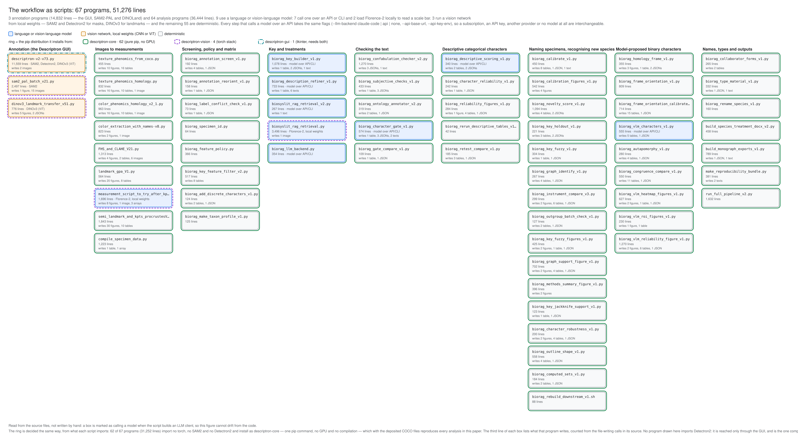</a>
  <br>
  <sub>All 67 programs by stage, with their size, whether they call a model, the pip distribution that installs them, and what they write. Click for full resolution.</sub>
</p>

The output column in the figure is **read from the source**, not written by hand:
a program is listed as writing a figure when its code calls `savefig`, a table
when it calls `to_csv`, and so on. The figure therefore cannot drift from the
code, and any program that writes nothing is a step that only feeds the next one.

---

## Reproducing an analysis

```bash
pip install descriptron-core
descriptron run_full_pipeline_v2 --help
```

With the deposited COCO files and the taxon profile, the pipeline regenerates the
measurements, the matrix, the key, the delimitation and every figure. The steps
that write prose are skipped unless a model backend is given, and none of the
numbers depends on one.

---

## Provenance and auditing

Two mechanisms, both meant for a reader who does not take your word for it.

**Every number is traceable.** `manuscript_numbers_v18.tsv` maps each number in
the manuscript to the report file that produced it, and the manuscript builder
refuses to typeset a number that no report supplies.

**Every output records how it was made.** `biorag_provenance_v1.py` stamps
outputs with the script and its SHA-256, the git commit, the full command line,
**a SHA-256 for every input file**, the interpreter and the time:

```bash
descriptron biorag_provenance_v1 --verify path/to/report.json
```

re-hashes the script and the inputs and tells you whether either has changed
since the output was written.

**And the text is audited independently of the model that wrote it.**
`biorag_confabulation_checker_v2.py` recomputes every statistic from the specimen
matrix, attributes every number in a treatment to one feature, and re-derives
every comparison — a value that is correct but attached to the wrong structure
fails, which is exactly what a generator checking its own output cannot catch.

---
<a id="mcp-server"></a>

## Use Descriptron from Claude (MCP server)

Descriptron can also be driven by an AI assistant. `descriptron-mcp` is an
[MCP](https://modelcontextprotocol.io) (Model Context Protocol) server: it lets
Claude Code, Claude Desktop, or any other MCP client run the Descriptron
programs for you. For example, you can ask *"summarise this COCO file and check it
for problems"*, *"build the key from this matrix"*, *"run SAM2-PAL on this folder
in the background"*, or *"write the treatment for this species from the matrix
and audit it"*.

The server runs **on your own computer** and works on **your own files**. It
runs the same programs you would run from a shell, so their results are the same.

**Writing and checking are kept apart.** When the assistant writes a species
treatment, it takes every number from the measured data and then submits the
text to the independent audit (`biorag_confabulation_checker_v2`). That audit
recomputes each value from the specimen matrix and flags any number printed
next to the wrong structure. The writer never marks its own work.

### Install

Python 3.10 or newer is needed for the server.

```bash
python -m venv descriptron-mcp-env
source descriptron-mcp-env/bin/activate        # Windows: descriptron-mcp-env\Scripts\activate

pip install descriptron-mcp                    # analysis programs (CPU)
pip install "descriptron-mcp[vision]"          # + detectors, SAM2-PAL, DINOLand (GPU)

descriptron-mcp --check                        # lists the programs it found
```

**With Docker instead** (no Python setup; includes the GPU programs):

```bash
claude mcp add descriptron -- docker run -i --rm --gpus all \
  --user "$(id -u):$(id -g)" -v "$HOME:$HOME" \
  ghcr.io/alexrvandam/descriptron:2.1.1 mcp
```

Without an NVIDIA GPU (e.g. on a Mac), leave out `--gpus all`: Docker refuses to start
with it, and everything except the GPU programs works the same.
`-v "$HOME:$HOME"` makes your files appear inside the container at the same
paths Claude uses; add another `-v /path:/path` for data elsewhere (e.g. an
external drive). `--user` makes the files it writes yours rather than root's.
Background jobs stop when the Claude session ends, because the container does.

### Connect it

**Claude Code**

```bash
claude mcp add descriptron -- /full/path/to/descriptron-mcp-env/bin/descriptron-mcp
```

**Claude Desktop**: Settings → Developer → Edit config, then add:

```json
{
  "mcpServers": {
    "descriptron": {
      "command": "/full/path/to/descriptron-mcp-env/bin/descriptron-mcp"
    }
  }
}
```

Restart the client and the Descriptron tools are available.

### What it offers

| tools | what they do |
|---|---|
| `list_programs`, `program_help` | the available programs and their options |
| `run_program` | run a program and report its output and the files it wrote |
| `start_job`, `job_status`, `job_log`, `cancel_job`, `list_jobs` | long runs (pipeline, SAM2-PAL, training) in the background |
| `coco_summary`, `read_table`, `read_text`, `list_files`, `view_image` | look at annotations, results, figures and specimen images |
| `species_evidence`, `audit_treatment` | write a treatment from the data, then audit it independently |

The annotation GUI is not part of the server. Annotation is interactive, and the
server works from the COCO files the GUI (or a detector) writes.

Configuration (for example, running the analysis in an existing conda
environment), tests and details: [packages/descriptron-mcp/README.md](packages/descriptron-mcp/README.md).

---

## Licence

Apache License 2.0 ([LICENSE](LICENSE)). Any redistribution of Descriptron, or of
software derived from it, must include the [NOTICE](NOTICE) file. Some bundled or downloaded components carry their own terms:
Detectron2 (Apache-2.0), SAM2 (Apache-2.0), Metric3D (BSD-2-Clause), EasyOCR
(Apache-2.0). **Model weights are licensed separately from code** — DINOv3 and
some Florence-2 checkpoints are gated and carry their own conditions, which you
should read before any commercial use. Descriptron's own licence does not
restrict commercial use; some model weights may.

---

## Citation

If you use Descriptron, or any software derived from it (including
descriptron-core, descriptron-vision, descriptron-gui and descriptron-mcp), in
work that is published, presented or distributed, cite:

1. **The software (Descriptron v2)**, by the DOI of the version you used:
   Van Dam, A. R. (2026). Descriptron: morphology-driven species descriptions,
   keys and delimitation for dark taxa (Version 2.1.1). Zenodo.
   https://doi.org/10.5281/zenodo.22958109
   (all versions: https://doi.org/10.5281/zenodo.17077224)
2. **The first Descriptron paper:**
   Van Dam, A. R. & Štarhová Serbina, L. (2026). Descriptron: Artificial
   intelligence for automating taxonomic species descriptions with a
   user-friendly software package. *Systematic Entomology*, 51(1), e70005.
   https://doi.org/10.1111/syen.70005
3. **The Descriptron v2 paper,** once it is published. Its reference will be
   added here.

```bibtex
@software{vandam_2026_descriptron_v211,
  author    = {Van Dam, Alex R.},
  title     = {Descriptron: morphology-driven species descriptions, keys and
               delimitation for dark taxa},
  version   = {v2.1.1},
  year      = {2026},
  publisher = {Zenodo},
  doi       = {10.5281/zenodo.22958109},
  url       = {https://doi.org/10.5281/zenodo.22958109}
}

@article{vandam2026descriptron,
  author  = {Van Dam, Alex R. and Štarhová Serbina, Liliya},
  title   = {Descriptron: Artificial intelligence for automating taxonomic species
             descriptions with a user-friendly software package},
  journal = {Systematic Entomology},
  volume  = {51},
  number  = {1},
  pages   = {e70005},
  year    = {2026},
  doi     = {10.1111/syen.70005}
}
```

The same information is in [CITATION.cff](CITATION.cff) (GitHub's "Cite this
repository" button) and in [NOTICE](NOTICE). Please also cite the tools
Descriptron builds on that you used (SAM2, DINOv3, Detectron2 and others; see
*Licence* above).
