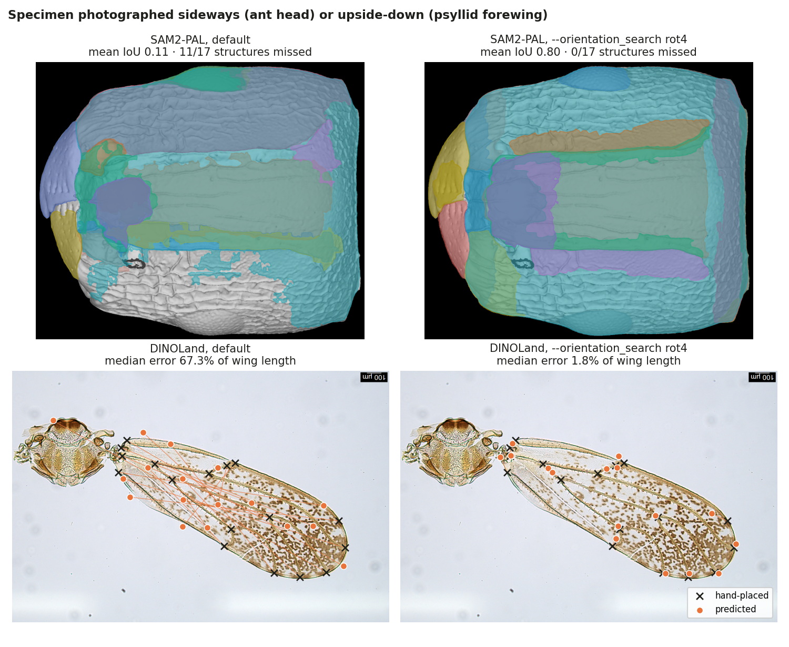

# SOP: propagating masks (SAM2-PAL) and landmarks (DINOLand)

Both tools copy what you drew on a few **reference** images onto many new images.
SAM2-PAL propagates segmentation masks; DINOLand transfers numbered landmarks
(keypoints). This page is the practical recipe: how to image, how many references
to draw, which options to switch on, and how to check the result. Every number
here comes from a test described at the end.

<p align="center">
  
  <br>
  <sub>Top: SAM2-PAL on an ant head photographed sideways. Bottom: DINOLand on a psyllid forewing photographed upside-down.
  Left: default settings. Right: <code>--orientation_search rot4</code>. Landmarks: predicted (filled) and hand-placed (×).
  One example each; typical values over all test specimens are in the tables below.</sub>
</p>

---

## 1. Before you start: imaging

**Photograph every specimen in the same orientation as your references.** This is
the single most important step. Both tools match image content that is *not*
rotation-invariant, so a specimen turned relative to the references is
effectively a different picture:

| specimen photographed | SAM2-PAL mean mask IoU (ant heads) | DINOLand median error (psyllid wings) |
|---|---|---|
| in the reference orientation | 0.78 | 5.3% of wing length |
| upside-down | 0.35 | 42.6% |
| turned 90° | 0.14 | 27–30% |

- Same view (frontal, dorsal, lateral…), same side up, same end pointing the same way.
- Same side of the animal where possible (all left wings, or all right wings). A
  wing photographed from the other side, or a right wing among left ones, is a
  **mirror image** (section 4).
- Fill the frame similarly; SAM2-PAL letterboxes every image into one square
  frame, so very different magnifications are tolerated but not free.
- Keep the background plain. SAM2-PAL removes it automatically (rembg) before
  matching.

The orientation options below are **fallbacks for collections you cannot
re-image**, not a substitute for consistent imaging. They are all **off by
default**.

---

## 2. Drawing references

| | SAM2-PAL | DINOLand |
|---|---|---|
| what you draw | masks (polygons / brush) in the Descriptron GUI | numbered landmarks in the Descriptron GUI |
| export | the marmot button writes COCO JSON (`.json` polygons and `.rlejson`) | COCO keypoints JSON, one per reference |
| how many | 1 template image + a few more labelled images for fine-tuning (we used 4) | **5 or more, from different species** (3 → 5 references: 61% → 70% of landmarks within 5% of wing length) |
| numbering | category names; use `left_…`/`right_…` for paired structures | landmark numbers must be identical in every reference |

- The **template image must appear in the COCO JSON** you give SAM2-PAL, otherwise
  it falls back to another image and the masks come out the wrong size.
- Keep only images in the target folder: mask PNGs and macOS `._` files in that
  folder are picked up as targets.

---

## 3. SAM2-PAL recipe

**Train (fine-tune) on your labelled images, then predict:**

```bash
descriptron-sam2pal \
  --template_image refs/template.png --template_json refs/annotations.json \
  --training_json refs/annotations.json --training_images_dir refs/ \
  --image_dir targets/ --output_dir out_sam2pal/ \
  --sam2_checkpoint sam2_hiera_large.pt --sam2_config sam2_hiera_l.yaml \
  --pal_finetuning --num_epochs 40 --learning_rate 1e-5 --max_images_per_epoch 60 \
  --num_points 30 --chunk_size 1 --interleave_template --cycle_consistency \
  --save_vis
```

**Predict new images with a model you already trained** (no retraining):
add `--load_checkpoint out_sam2pal/finetuned_sam2_pal.pt` and drop the training flags.

In the GUI: *SAM2-PAL* dialog → template image + COCO JSON, fine-tuning on,
*Load checkpoint* for prediction-only runs.

**Options:**

| option | when | effect in our test |
|---|---|---|
| `--flip_augment all` | optional, when fine-tuning | adds flipped copies of the labelled images; upright heads 0.760 → 0.776 (p = 0.048). Does **not** fix turned specimens |
| `--orientation_search rot4` | some specimens turned or upside-down | predicts every image at 0/90/180/270°, keeps the rotation with the highest mean SAM2 object confidence and maps the masks back. Turned heads 0.14 → 0.78; right rotation chosen 56/56. 4× slower |

**Mirror images:** SAM2-PAL cannot tell a mirrored specimen from a normal one on a
bilaterally symmetric structure, so `left_`/`right_` names follow the image as
photographed. Image all specimens from the same side.

**Checking the output:**
- `pal_predictions.json` (COCO) opens in the GUI via *View Predictions*; with
  `--save_vis`, `visualizations/vis_*.png` show every mask with a legend.
- `obj_conf` on each mask is SAM2's own confidence; low values mark masks to look at.
- `cycle_iou` (palindrome round trip) is **not** a quality score: it was 0.996 for
  every image, upright or turned.
- With orientation search, each image records `orientation_used` (degrees
  clockwise) and `orientation_search_report.json` lists the confidence of every
  rotation, so specimens imaged differently are easy to find.
- Correct the masks that are wrong in the GUI, add those images to the training
  JSON and fine-tune again: a few corrected images improve the next round.

---

## 4. DINOLand recipe

```bash
descriptron-dinoland \
  --imgA refs/ref1.tif --landmarks refs/ref1.json,refs/ref2.json,refs/ref3.json,refs/ref4.json,refs/ref5.json \
  --ref_dir refs/ --batch_glob "targets/*.tif" --batch_n 999 \
  --align feature --outdir out_dinoland/ --emit_refs
```

In the GUI: *DINOLand* dialog → batch mode, reference image and landmark JSONs,
target glob, then the checkboxes below.

**Options — switch on only what your specimens need:**

| your specimens | options | effect in our tests |
|---|---|---|
| all in the reference orientation | none | — |
| some turned or upside-down | `--orientation_search rot4` | wings turned 90/180/270°: median error 27–43% → 3.1–3.2% of wing length; failing wings 48/60 → 3/60 |
| some mirror images (other side, other body side) | `--mirror_refs` | mirrored wings failing 16/17 → 1–2/17 |
| both, or you do not know | `--orientation_search rot4 --mirror_refs` | mixed set (mirrored and normal wings, each at 0/90/180/270°): median error 28.6% → 2.5%, failing wings 53/80 → **0/80** |

Each option adds reference copies (rotated, flipped) and lets every target keep
the group of references that matches it best. On the mixed set each option alone
fixed only its own problem (orientation search alone: mirrored wings still 19–20%
error; mirror alone: turned wings still 20–23%); together they fixed both. The extra
reference copies are cheap (80 wings on CPU: 3.6 min without options, 3.9 min with
both). An option you do not need costs at most a little accuracy: adding `--mirror_refs` to wings that were
not mirrored changed the median error from 3.2% to 3.9% in one test and not at
all (2.4%) in the other. **If you do not know how your specimens were imaged,
switch both on.**

**Model and layer:** the default (DINOv3 ViT-B/16, layer 6) is a good start.
ViT-L/16 with layer 12 was slightly better on psyllid wings (median error 4.0%
vs 4.7%) and slower; the last layer (23) was worse (5.2%) — deep features match
*which structure* but not *where exactly*.

**Checking the output:**
- `predictions_keypoints.json` holds all targets (opens in the GUI); each
  landmark has `v = 2` when the references agree and `v = 1` when it needs a look.
- `fig4_batch_transfer_p*.png` are review pages with every target.
- With `--emit_refs`, targets whose landmarks all came back confirmed are listed
  in `refs_confirmed.txt`; after you check them they can be used as extra
  references in the next run.
- `handedness_used` and `orientation_used` record which reference group each
  target matched.

---

## 5. Docker

The same commands run inside the Descriptron image (GPU on Linux and Windows):

```bash
docker run --rm --gpus all -v "$PWD:/data" -v descriptron-weights:/weights \
  ghcr.io/alexrvandam/descriptron:latest dinoland \
    --imgA /data/refs/ref1.tif --landmarks /data/refs/ref1.json,/data/refs/ref2.json \
    --ref_dir /data/refs --batch_glob "/data/targets/*.tif" --outdir /data/out_dinoland \
    --orientation_search rot4
```

Replace `dinoland` with `sam2-pal` for SAM2-PAL. See [DOCKER_RECIPE.md](DOCKER_RECIPE.md).

---

## 6. Where the numbers come from

- **SAM2-PAL:** 4 labelled grey ant heads (*Tetramorium*, 31 categories) for
  fine-tuning, 14 held-out heads (235 head × structure pairs) scored against
  hand-drawn masks; copies of the 14 turned 90° each way and flipped. Mean IoU per
  structure, a missed structure counts as 0.
- **DINOLand:** *Diaphorina* forewings with 17 hand-placed vein-junction
  landmarks, error as a percentage of wing length; a wing "fails" when its median
  error exceeds 20%. Orientation test: 20 wings × 4 turns, 3 references. Mirror
  test: 89 wings, 17 of them mirrored. Mixed test: 10 mirrored + 10 normal wings × 4 turns.
- All options were tested against the identical run without them (same
  references, same targets, same model).
