# Descriptron tutorial: from images to measurements, analyses and descriptions

This walks through the annotation GUI tab by tab, in the order you would normally work. Each tab
has its own colour and number; the annotation tools above the tabs are always there.

Start the GUI (pip install or Docker, see the README), then press **?** at any time for the
keyboard shortcuts. Hover over any button for a short explanation.

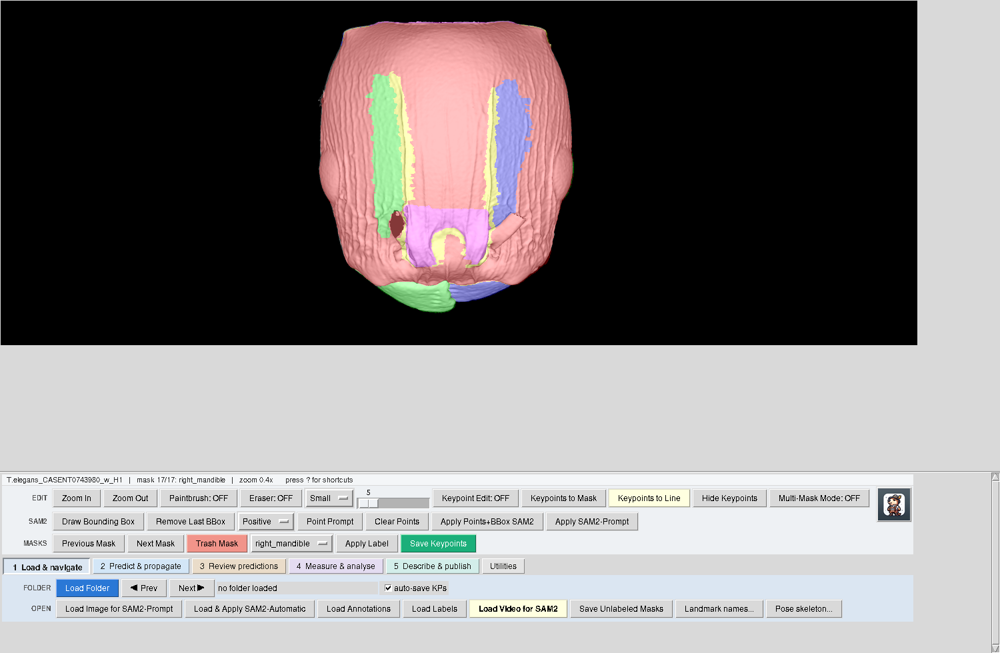

---

## The parts of the window

- **Image area** (top): the specimen with its masks, landmarks and lines. Middle-drag to pan.
- **Status bar** (just below the image): image name, position in the folder, current mask and its
  label, number of keypoints, the active tool, zoom, and - when a landmark list is loaded - which
  landmark to place next.
- **Toolbar** (always visible), used in every workflow:
  - **EDIT** - zoom; paintbrush and eraser (B / E) with preset sizes plus a size slider ([ and ]);
    keypoint editing (K); keypoints to mask or to line; hide keypoints; multi-mask view.
  - **SAM2** - draw a box or click positive / negative points around a structure, then apply SAM2.
  - **MASKS** - previous / next mask (P / N), trash, choose a label and apply it, save keypoints.
    Paintbrush and eraser strokes can be undone with **Ctrl+Z**.
  - The **marmot** (right) saves the whole session to COCO JSON.
- **Tabs** 1-5 and Utilities (keys 1-5 switch tabs). The GUI reopens on the tab and window size you
  last used.

---

## 1  Load & navigate

- **Load Folder** opens a folder of images to annotate one after another (PageDown / PageUp);
  landmarks are saved automatically when you move on ("auto-save KPs").
- **Load Image for SAM2-Prompt** opens one image; **Load & Apply SAM2-Automatic** lets SAM2
  segment everything it can find.
- **Load Annotations** puts an existing COCO file on the image for checking or editing.
- **Landmark names...** loads your landmark list (one name per line, or a COCO file); the status bar
  then tells you which landmark comes next ("next landmark 5/17: vein_junction_5").
- **Pose skeleton...** defines landmark names and the connections between them. Sticks are drawn
  between placed points and the skeleton is saved with the keypoints (the COCO "skeleton", which
  DeepLabCut and SLEAP also read). A DeepLabCut `config.yaml` can be loaded directly.

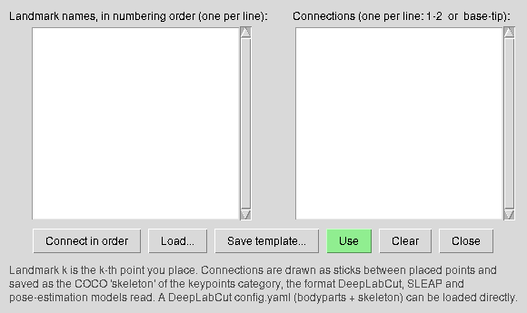

**Annotating** - for each structure: draw a box or click points, apply SAM2, correct with the
paintbrush and eraser, choose the label and apply it. For landmarks: turn on keypoint editing and
click the landmarks in their numbering order (negative points mark a landmark that is absent).

---

## 2  Predict & propagate

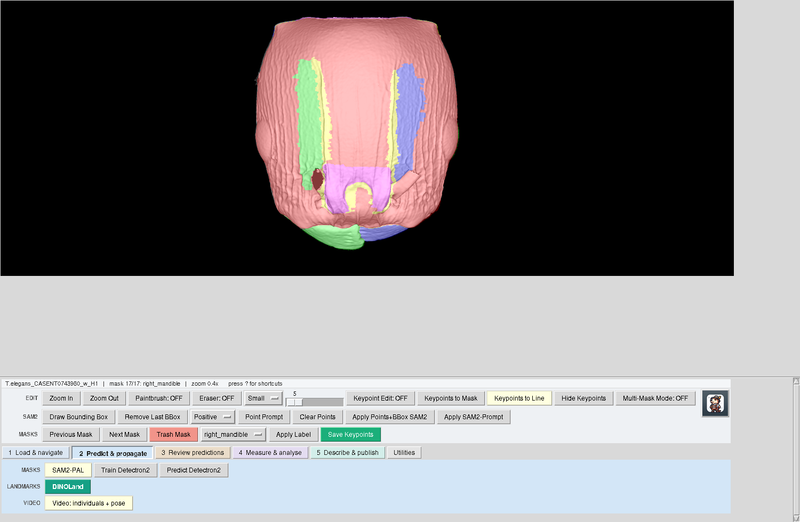

Annotate a few specimens by hand, then let a model do the rest of the collection:

- **SAM2-PAL** copies masks from a few annotated images to a whole folder. Options include
  *orientation search* for specimens photographed turned, and flip augmentation when fine-tuning.
- **DINOLand** copies landmarks from a few reference images (five or more from different species work
  best). Options: *orientation search* and *mirror references* for turned or mirror-image specimens.
- **Train / Predict Detectron2** trains an instance-segmentation model on your corrected
  annotations. Training now keeps a real validation set: give it the val.json from Utilities >
  Prepare for Detectron2, or a share of specimens is held out automatically (a specimen-ID pattern
  keeps all images of one specimen on the same side).
- **Video: individuals + pose** follows each specimen through a video (SAM2) and carries the pose
  keypoints from a few labelled frames, with a confidence per point; exports a DeepLabCut CSV.

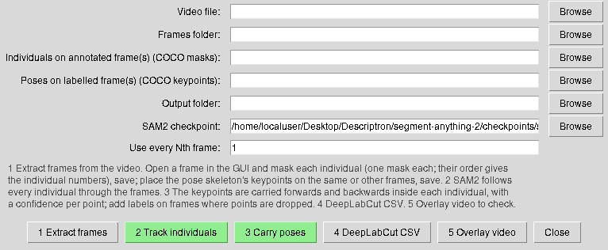
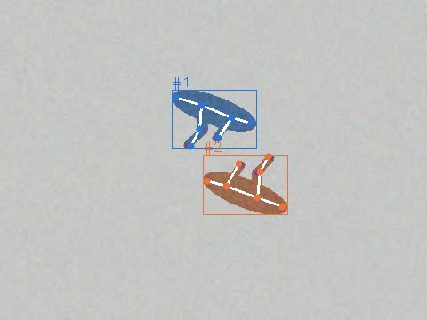

See the [SAM2-PAL & DINOLand annotation SOP](SAM2PAL_DINOLand_Annotation_SOP.md) for imaging advice
and recipes.

---

## 3  Review predictions

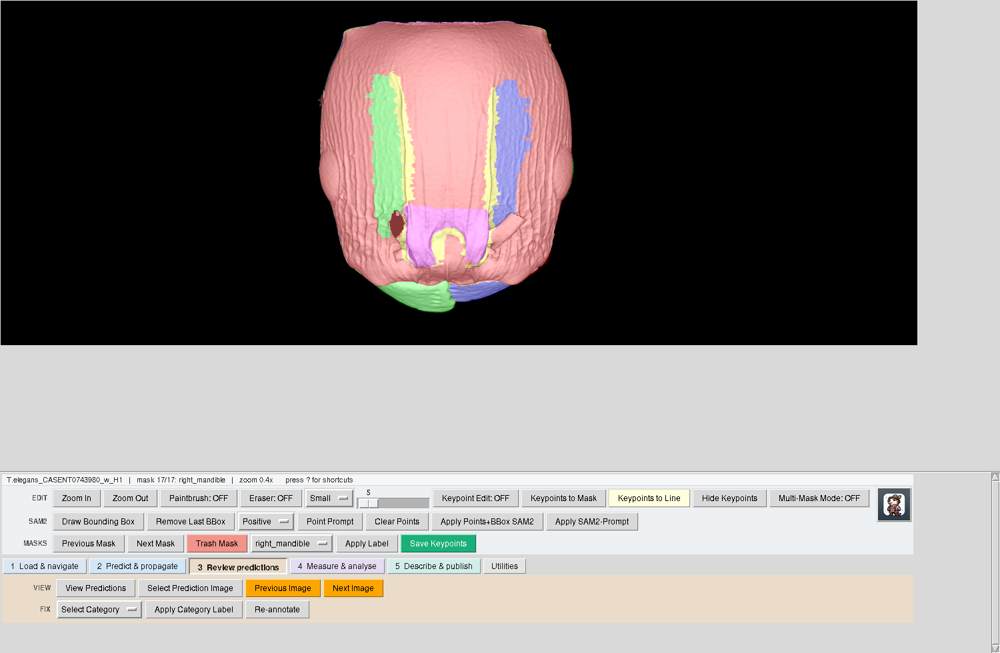

Open the predictions, step through them (Previous / Next Image), rename a prediction's category, and
**Re-annotate** to edit its masks with the toolbar. Corrected images can go back into training: a few
rounds of predict - correct - retrain usually leave little to correct.

---

## 4  Measure & analyse

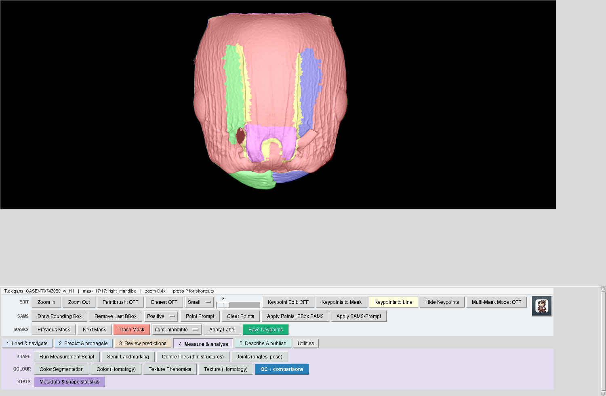

- **Run Measurement Script** - lengths, widths, areas in mm (scale bars read automatically).
- **Semi-Landmarking** - outline shape, generalised Procrustes analysis, PCA, MANOVA, CVA, allometry.
- **Centre lines (thin structures)** - curved length, straight length, sinuosity, width and curvature
  along veins, antennae, legs and setae. A straight measurement under-reads curved structures (by
  17-23% on test arcs and S-curves); the centre line is within 0.3% of the true length. These are
  extra measurements; the existing ones are unchanged. Branches are ignored unless you ask for them.
- **Joints (angles, pose)** - joint angles from the pose skeleton as characters, and rotation of
  articulated parts to a common angle before GPA, so posture does not masquerade as shape.
- **Colour** and **texture** - colour classes, colour and texture on grids of homologous cells.
- **Metadata & shape statistics** - see below.

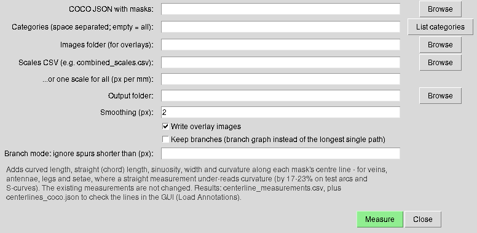
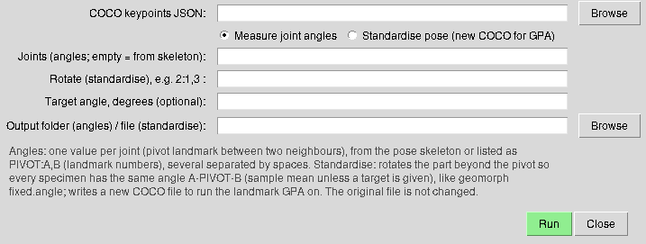

### Metadata and shape statistics

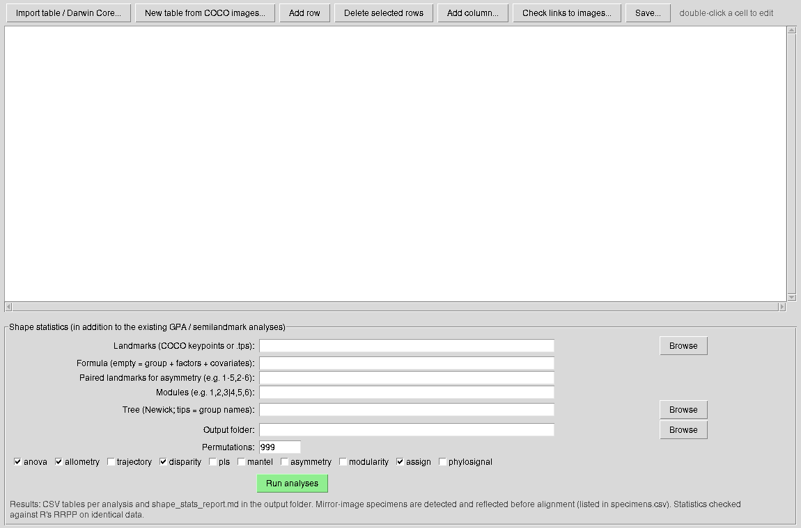

1. **Import** your metadata: a table you filled in (CSV, TSV, Excel) or Darwin Core as you get it from
   GBIF (`occurrence.txt` or the whole download .zip). Or start a new table from the images of a COCO
   file and type into it (double-click a cell).
2. **Check the roles** the columns were given: specimen ID, group (usually the species), other
   factors (locality, sex, host...), continuous covariates (elevation...), latitude / longitude, or
   ignore. Darwin Core terms are recognised automatically.
3. **Check links to images** - specimens are found by their ID in the image file name.
4. **Run analyses** on your landmarks. Each runs only when the metadata supports it, and all of them
   come in addition to the existing GPA analyses:

| analysis | question |
|---|---|
| anova | does shape differ by species, locality, sex...; do effects interact (species x locality)? |
| allometry | is the size-shape relationship the same in every group? |
| trajectory | do species change shape in the same direction and amount across localities? |
| disparity | are some groups more variable? |
| pls | is shape related to the environmental covariates? |
| mantel | is shape distance related to geographic distance? |
| asymmetry | directional asymmetry and each specimen's asymmetry (paired left/right landmarks) |
| modularity | do parts of the structure vary independently (CR), or together (PLS)? |
| assign | which group does an unlabelled specimen belong to - or none of them? |
| phylosignal | how much of shape follows the phylogeny (Kmult)? |

Mirror-image specimens (a wing photographed from the other side) are detected and reflected before
alignment, and listed. The same now happens in the Semi-Landmarking step (default alignment
"reflect_mirrored", listed in `reflected_specimens.csv`) and in the landmark GPA of the pipeline.

**Checked against R.** With the same raw landmarks, geomorph (4.1.1) and Descriptron agree on centroid
size, Procrustes distances, Procrustes ANOVA, disparity, modularity (CR), two-block PLS, Kmult and
asymmetry to at most 5.6 x 10^-4 (most to 10^-6 or better). Settings that match Descriptron:
`gpagen(Proj = FALSE)` (with the default tangent projection values differ by about 5 x 10^-5),
`morphol.disparity(coords ~ group, groups = ~ group)`, `modularity.test(opt.rot = FALSE)`; Descriptron's
per-specimen asymmetry is half geomorph's asymmetry component (the asymmetric component of Klingenberg et
al. 2002).

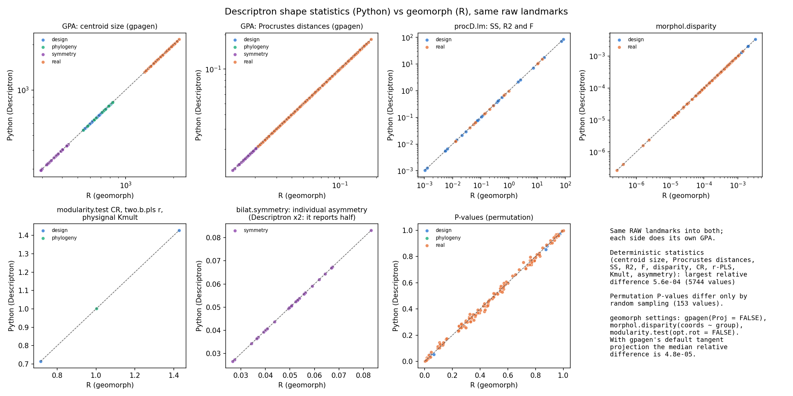

Outline semilandmarks: placed at equal arc length. In the Semi-Landmarking dialog, "Sliding (as geomorph)"
chooses none (fixed, the default), procd (minimum Procrustes distance) or bending (minimum bending energy,
geomorph's default when it slides); all three agree with `gpagen` on the same points. The three methods give
somewhat different results from each other, so report which one you used. After the superimposition the
semilandmarks are frozen in their settled correspondence and mapped back onto each photograph; the colour and
texture homology steps use them to measure every specimen in the same anatomical cells.

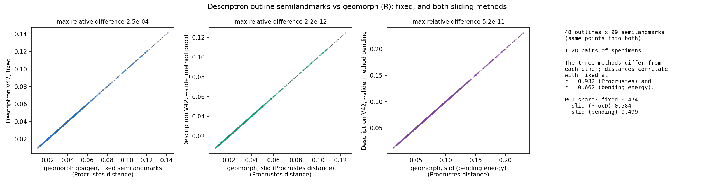

The outline shape PCA of the Semi-Landmarking step is computed on the covariance of the Procrustes
coordinates, as geomorph's `gm.prcomp` (earlier versions standardised every coordinate first, which gives
points that barely vary the same weight as the rest; `--shape_pca standardized` reproduces them). Landmark GPA,
the homology frames, and the colour and texture homology cells were checked the same way:

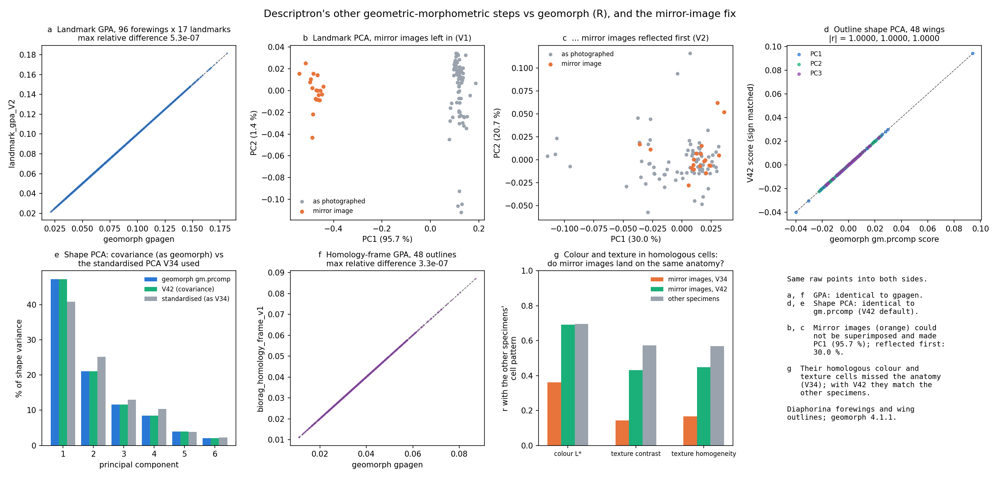

On identical Procrustes-aligned data the statistics also agree with RRPP to 5 x 10^-12 (trajectory analysis
included), the permutation P-values within sampling noise.

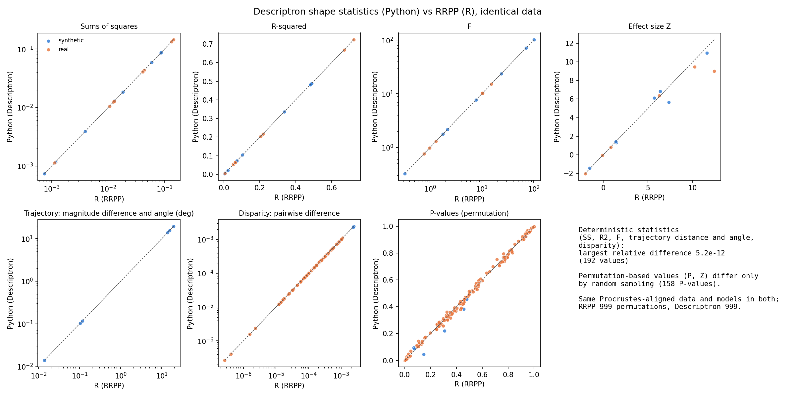

---

## 5  Describe & publish

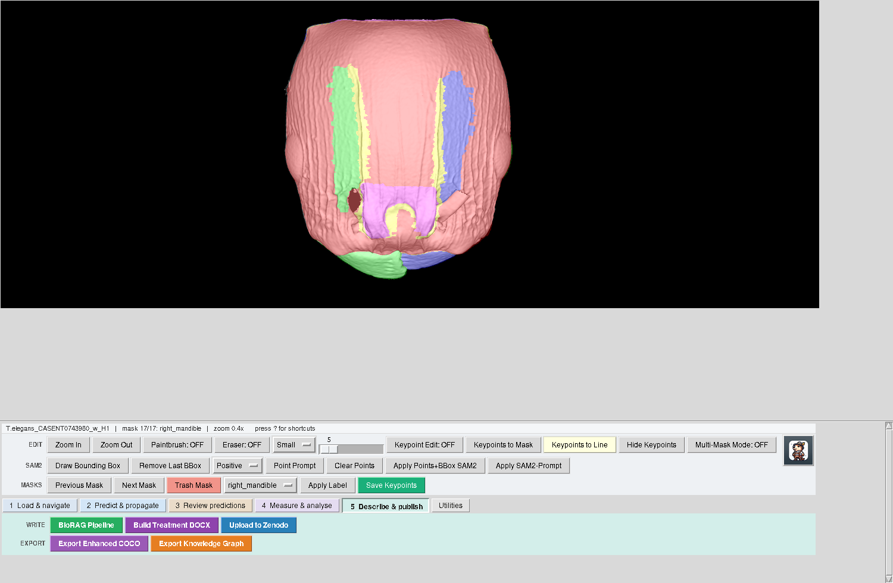

- **BioRAG Pipeline** - the character matrix, a computed key and audited species descriptions.
- **Build Treatment DOCX** - formatted treatments; **Upload to Zenodo**; **Export Enhanced COCO** and
  **Export Knowledge Graph** (JSON-LD with ontology terms).

---

## Utilities

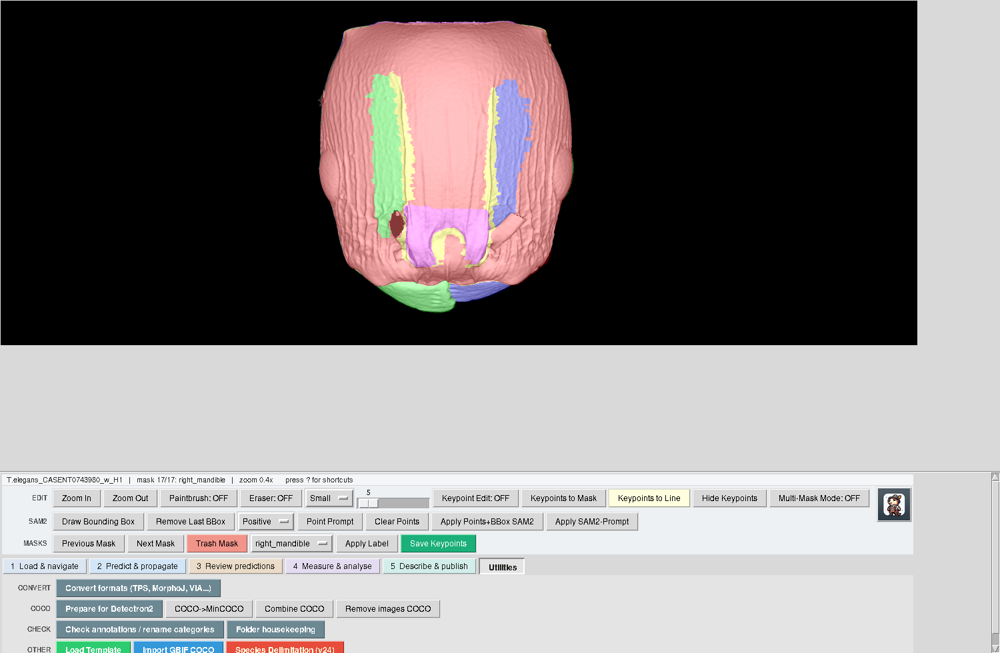

- **Convert formats** - tpsDig (.tps), MorphoJ, StereoMorph, landmark tables and VGG Image Annotator 2
  (project files, region exports and VIA's own COCO export, keeping the points and polylines VIA's
  exporter drops) into Descriptron COCO, and back to .tps / MorphoJ. "One file per image" writes
  DINOLand references.
- **Prepare for Detectron2** - Combine COCO + COCO->MinCOCO + a train / validation split by specimen.
- **Check annotations / rename categories** - one report of missing or mismatched image files,
  category names that differ only by spaces or underscores, empty or misplaced masks, landmark sets of
  different lengths; rename or merge categories.
- **Folder housekeeping** - remove macOS `._` files, move mask PNGs out of image folders, 8-bit PNG
  copies of 16-bit TIFFs (shows what it would do before doing it).

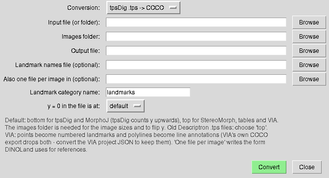
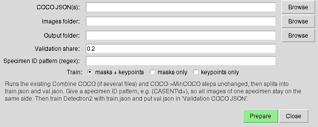
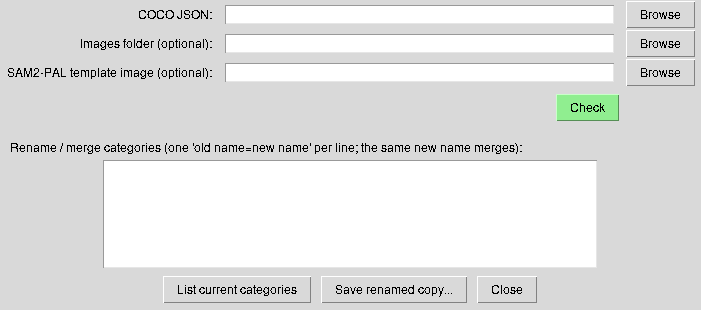

---

## Keys (API keys)

Species descriptions with the API backend need an Anthropic API key, and DINOLand needs a Hugging
Face token the first time it downloads DINOv3. You are asked once, when first needed, and the key is
kept in `~/.config/descriptron/credentials` (readable only by you). See the README.
